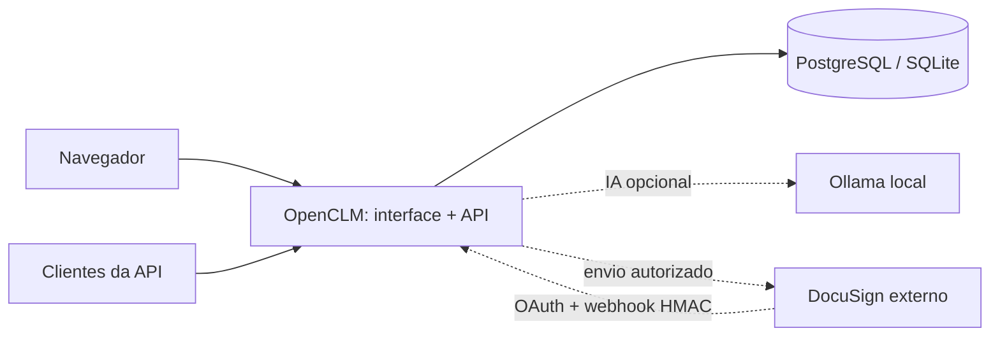
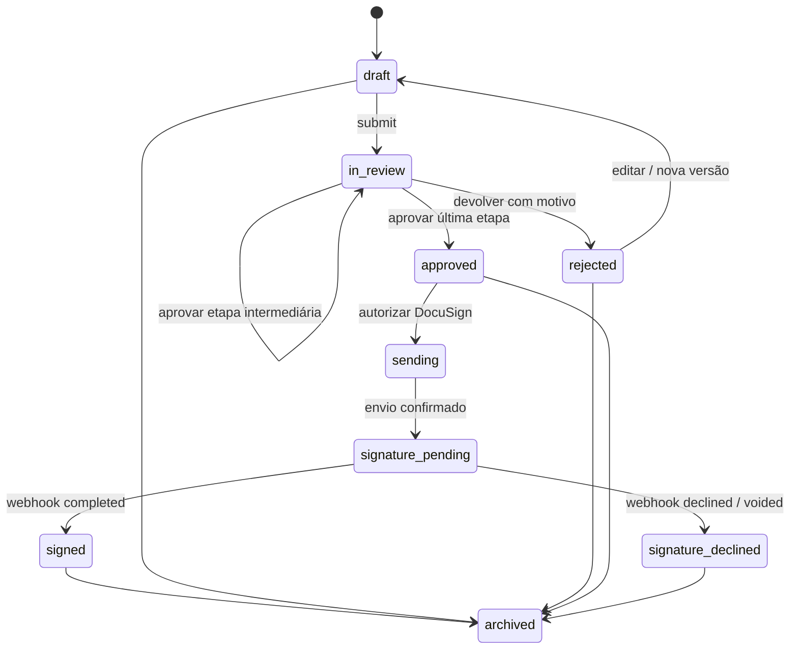

# Arquitetura da base

## Escolhas

Um monólito modular em Python/FastAPI reduz a quantidade de serviços necessários. A interface usa HTML, CSS e JavaScript servidos pela própria aplicação, sem CDN ou build obrigatório de frontend. SQLAlchemy dá suporte a SQLite e PostgreSQL; Alembic controla o esquema. As dependências Python têm resolução fixa em `uv.lock`.



Nenhum componente do OpenCLM exige um serviço operado pelo mantenedor do projeto. DocuSign é uma integração externa explícita; Ollama deve ser operado no ambiente do administrador.

## Domínio

| Entidade | Responsabilidade |
| --- | --- |
| User | Identidade local e perfil de acesso |
| Token | Hash de sessão/chave de API, titular e expiração |
| Workflow | Definição imutável de etapas sequenciais |
| Template | Texto, perguntas tipadas e workflow associado |
| Contract | Respostas, conteúdo atual, autor, status e cópia do workflow |
| DocumentVersion | Conteúdo, respostas, título e contraparte de cada versão; SHA-256 do conteúdo textual |
| AuditEvent | Ação, ator, instante e metadados, sem segredos OAuth |
| DocuSignConnection | Conta por usuário e credenciais criptografadas |
| OAuthState | Vínculo temporário entre consentimento e sessão iniciadora |
| SignatureRequest | Reserva única, remetente, conta, envelope e versão enviada |
| WebhookEvent | Hash do corpo de eventos processados para deduplicação |

As definições de modelos e workflows são criadas, consultadas e preservadas; sua edição ainda não é exposta. Para alterar uma definição, crie outra. A API permite editar um contrato em rascunho/devolvido gerando uma nova versão.

## Ciclo de vida



A API não permite definir o status por edição genérica. Edições e transições exigem a `revision` atual, e uma coluna de versão do SQLAlchemy detecta alterações concorrentes no commit. `version` numera documentos; `revision` protege qualquer alteração de estado. Aprovação exige papel e etapa corretos, além de um aprovador diferente do autor.

## Organização do código

```text
openclm/
  api.py          contratos, formulários, workflow, autenticação e integração
  oauth.py        consentimento DocuSign, criptografia e refresh
  integrations.py clientes HTTP DocuSign e Ollama
  documents.py    validação de respostas, renderização e DOCX
  models.py       persistência
  schemas.py      contrato da API
  security.py     senhas, sessões, chaves e permissões
  main.py         aplicação, headers, limites e recursos locais
  cli.py          administração inicial e recuperação
  static/         interface e explorador OpenAPI
migrations/       esquema versionado
tests/            testes de domínio, acesso, OAuth, webhooks e migrações
```

## Próximos incrementos

1. Homologar OAuth, envio, HMAC e conciliação com contas reais de demonstração; arquivar PDF assinado e certificado.
2. Publicação e revisão de modelos, importação DOCX e editor de documentos com alterações rastreadas.
3. Filas/outbox duráveis para integração, retentativas com reconciliação e observabilidade sem conteúdo sensível.
4. Permissões por contrato/departamento, SSO/OIDC, MFA e administração de sessão pela interface.
5. Workflows condicionais, prazos/SLA, lembretes, obrigações e renovações.
6. Upload, busca no conteúdo, extração e perguntas com referência aos trechos de documentos longos por IA local.

Antes de escalar para múltiplas réplicas, separar a execução de migrações do startup e adicionar controles distribuídos de abuso, filas e testes de carga. Esta base inicia um processo de aplicação por container.
